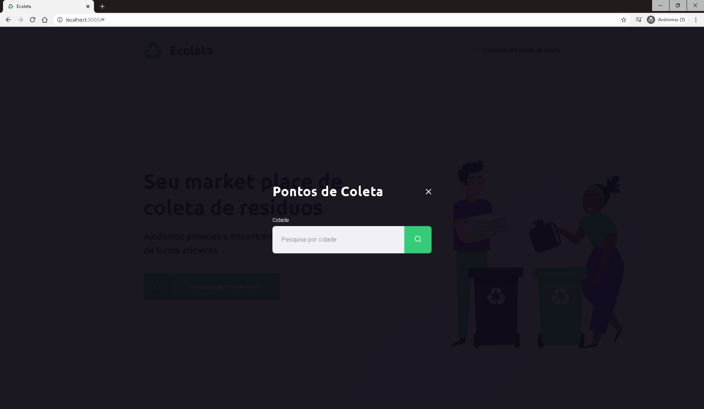
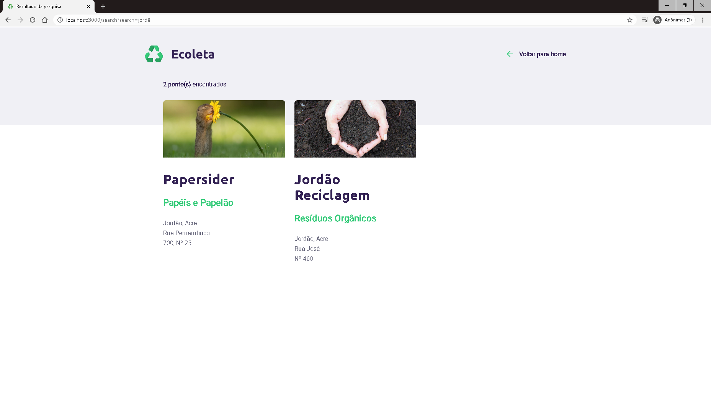
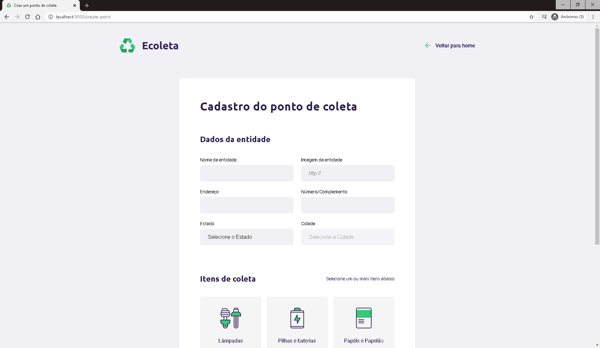
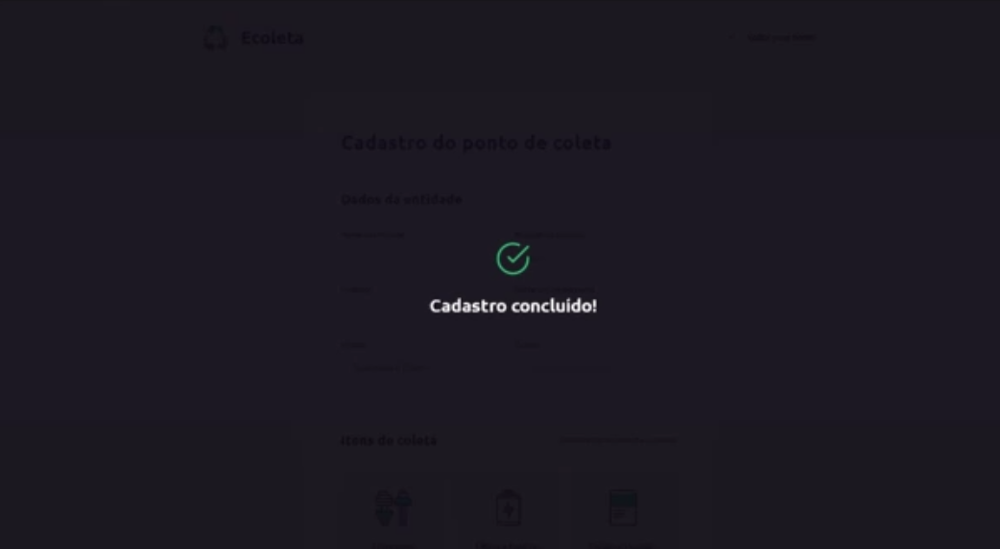
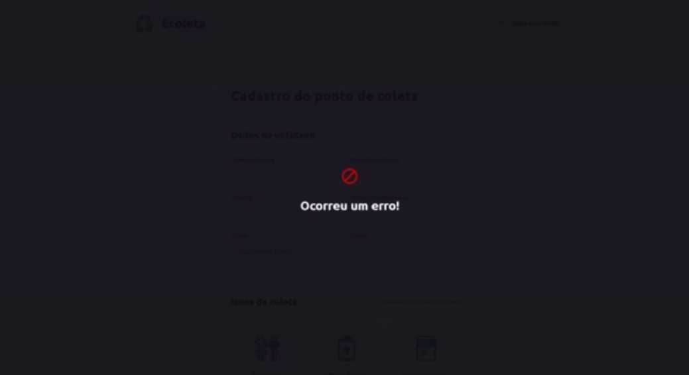

<h1>Projeto:</h1>

Aplicação desenvolvida, de forma guiada, pela iniciativa da NLW (Next Level Week) da equipe Rocketseat. Simula um site de busca e de cadastro de pontos de coleta de reciclagem.

<h2>Home:</h2>

Alterações pessoais: adição do favicon.

<h2>Busca:</h2>

<h2>Resultado de busca</h2>

<h2>Página de cadastro</h2>

<h2>Cadastro concluído</h2>

Após o cadastro é automaticamente retornado para a página principal.

<h2>Erro no cadastro</h2>

Após o erro é automaticamente retornado para a página de cadastro.

